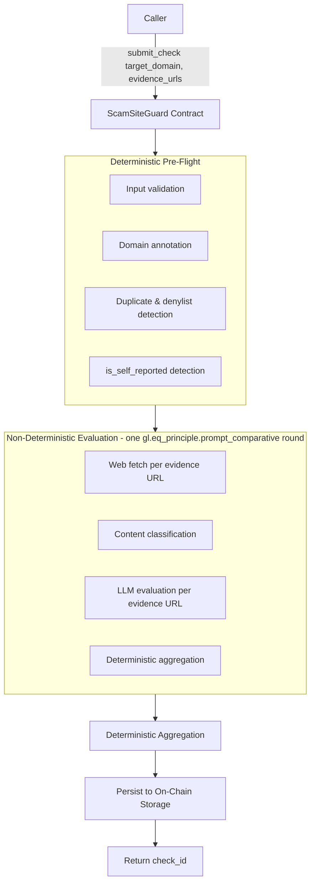
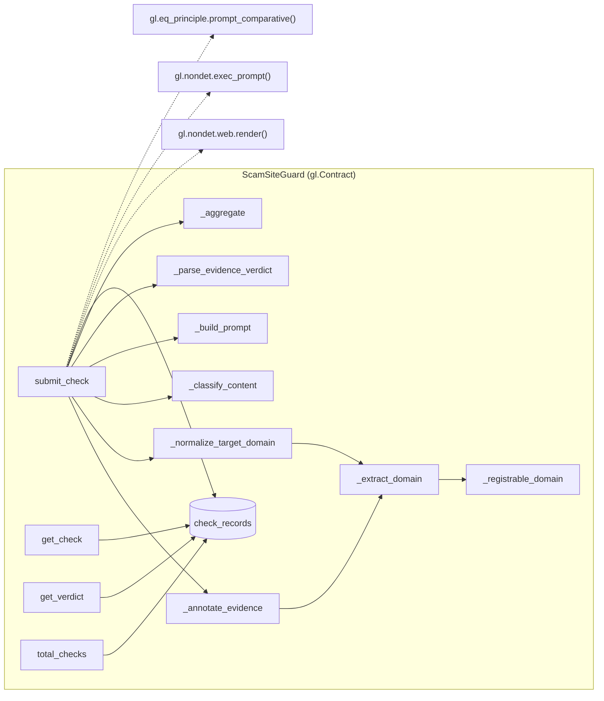
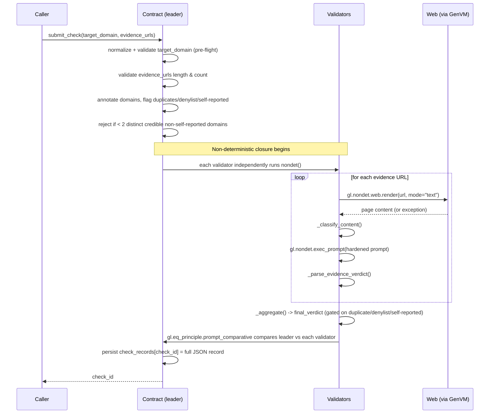
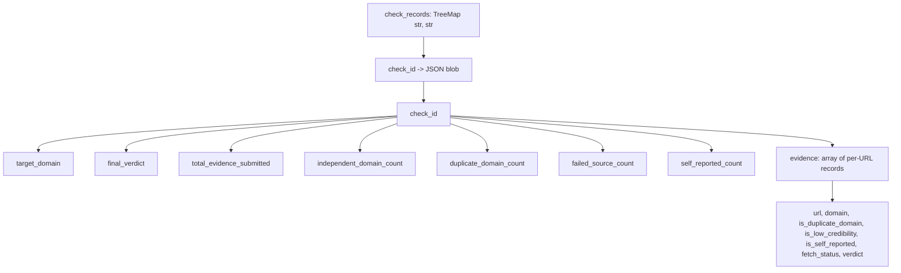

# Architecture

## 1. High-Level Architecture

Every step in the "Deterministic Pre-Flight" subgraph runs on plain caller-supplied strings — no I/O, so every validator computes byte-identical results without needing consensus machinery. Only the "Non-Deterministic Evaluation" subgraph touches the network or an LLM, and it is wrapped in exactly ONE `gl.eq_principle.prompt_comparative` call.

## 2. Component Diagram

Every function above is a plain instance method with `self` as the first parameter (GenVM lint rule E022 rejects `@classmethod`/`@staticmethod` on contract methods), each with a single, narrow purpose — this is what makes the 128-test offline suite possible: each one is independently testable without a live GenLayer node. `_normalize_target_domain` deliberately delegates to `_extract_domain` (rather than re-implementing hostname parsing) for exactly this reason: one deterministic function stays the single source of truth for "URL/domain string → registrable domain," whether the input is an evidence URL or the target domain itself — this is precisely what makes `is_self_reported`'s domain comparison correct (both sides go through the same normalization).

## 3. End-to-End Execution Flow

Note that self-reported evidence is NEVER skipped in the fetch/judge loop — it goes through the exact same pipeline as every other URL, and is only excluded at the `_aggregate` step. This is deliberate: the on-chain record shows exactly what the target's own page claimed, and shows that it was excluded, rather than the record simply being absent (see [DESIGN_DECISIONS.md § 1](DESIGN_DECISIONS.md#1-why-self-reported-exclusion-is-structural-not-llm-judged)).

## 4. Why `prompt_comparative`, Not `strict_eq`

GenLayer's own guidance is explicit that `gl.eq_principle.strict_eq()` must never be used for LLM-derived output, because independent LLM calls are not guaranteed to produce byte-identical text across validators even when they reach the same substantive conclusion. This contract uses `gl.eq_principle.prompt_comparative(nondet, principle=EQUIVALENCE_PRINCIPLE)` instead: each validator independently runs the exact same `nondet()` closure, and an NLP comparator judges the leader's result and each validator's result as *equivalent* against `EQUIVALENCE_PRINCIPLE` — not byte-for-byte identical.

Every value that ends up in the returned JSON is restricted to a small, fixed vocabulary (`FINAL_VERDICTS`, `EVIDENCE_VERDICTS`, `FETCH_STATUSES`) specifically so the comparator's job stays simple: check categorical equality of a handful of fields, not judge open-ended prose.

## 5. Why Multiple Evidence Sources

A single piece of evidence — even a genuinely third-party one — can be wrong, outdated, or itself unreliable. Requiring `MIN_EVIDENCE_SUBMITTED = 3` candidate URLs and `MIN_INDEPENDENT_DOMAINS = 2` distinct, eligible, agreeing domains before declaring `LikelyScam`/`LikelyLegitimate` means no single source, however confident its content sounds, can unilaterally determine the verdict.

## 6. Why Self-Reported Exclusion Is the Headline Mechanic

Unlike a general fact-checking contract, scam verification is adversarial by construction: the entity being evaluated (the target domain) has every incentive to publish favorable content about itself, and controls that content completely. Duplicate-domain and denylist detection alone don't address this — a target's own domain isn't a duplicate of anything, and it's very unlikely to be on a static denylist. `is_self_reported` closes this gap with a deterministic, un-gameable rule: same registrable domain as the target = never counts, regardless of content. See [DESIGN_DECISIONS.md § 1](DESIGN_DECISIONS.md#1-why-self-reported-exclusion-is-structural-not-llm-judged) for the full alternatives-considered discussion.

## 7. Why Provenance Matters

`_annotate_evidence` computes domain, validity, duplicate status, denylist status, and self-reported status for every URL *before* any network access, and this metadata is persisted on-chain in full — a reviewer can audit exactly why any given piece of evidence did or didn't count toward the final verdict, not just what the final verdict was.

## 8. Storage Model

One JSON blob per check, not native nested storage types — GenLayer's persistent storage restrictions (no arbitrary nested list/dict types) make this the natural fit, and it keeps the entire evidence trail atomically consistent with the verdict that was derived from it.

## 9. Consensus Model

GenLayer's Optimistic Democracy: a leader validator executes `nondet()` first, then every other validator independently re-executes the identical closure. `gl.eq_principle.prompt_comparative` compares each validator's result against the leader's using `EQUIVALENCE_PRINCIPLE` as the judgment criterion. Consensus is reached when enough validators' results are judged equivalent to the leader's — not when every byte matches.

## 10. Security Model (Summary)

Self-vouching, prompt injection, Sybil-style duplicate-domain stuffing, known-unreliable evidence domains, and fetch failures are all explicitly mitigated with tests. Full threat model: [SECURITY.md](SECURITY.md).

## 11. Design Trade-offs (Summary)

Full detail in [DESIGN_DECISIONS.md](DESIGN_DECISIONS.md). In brief: this contract intentionally does not implement a full Public Suffix List, cross-domain content-similarity detection (catching a scam operator's *second*, formally-unrelated domain), cryptographic provenance, or a spam/staking mechanism. Each of these is a deliberate scope boundary for an initial submission, not an oversight — see [ROADMAP.md](ROADMAP.md) for what a production evolution would add.
