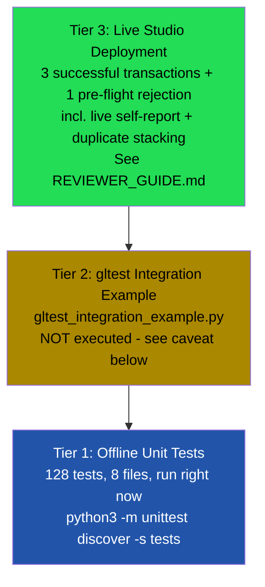

# Testing

ScamSiteGuard has three tiers of testing: offline unit tests (128, all passing, run in this repository), an unexecuted live-integration example (`gltest_integration_example.py`), and (pending) real deployment evidence on GenLayer Studio. This document explains what each tier proves and what it does not.

---

## 1. Testing Pyramid



Higher tiers give stronger real-world confidence but cost more to run. Tier 1 is what's actually verified in this repository right now.

---

## 2. Tier 1 — Offline Unit Tests

**Run them:**
```bash
python3 -m unittest discover -s tests -p "test_*.py" -v
```

**Result: 128/128 passing.** These run against a small local stub of the `genlayer` SDK (`tests/genlayer_stub/`) — no GenLayer node, network access, or real LLM required. `gl.nondet.web.render` and `gl.nondet.exec_prompt` are monkeypatched per test to simulate specific scenarios deterministically.

### 2a. Unit tests (pure functions, no mocking needed)

| File | Tests | Function under test | What it proves |
|---|---|---|---|
| `test_domain_extraction.py` | 33 | `_extract_domain`, `_registrable_domain`, `_normalize_target_domain` | Subdomain-independence; multi-part suffix handling; IPv6/trailing-dot edge cases; the critical property that a target and its subdomain normalize to the same value |
| `test_content_classification.py` | 13 | `_classify_content` | All five malformed-content checks, plus explicit false-positive guards |
| `test_aggregation.py` | 17 | `_aggregate` | Every branch of the final-verdict decision rule, including self-reported/duplicate/low-credibility exclusion, and every combination thereof |
| `test_parser.py` | 13 | `_parse_evidence_verdict` | Exact/case-insensitive matching, multi-line responses, substring false-positive guard |
| `test_prompt_and_consensus.py` | 15 | `_build_prompt`, `EQUIVALENCE_PRINCIPLE` | Every guardrail phrase is actually present in the model prompt; the equivalence principle references real schema fields |

These 91 tests require zero mocking — they call deterministic functions directly with crafted inputs and assert exact outputs.

### 2b. Integration-style tests (within the offline stub)

| File | Tests | What it proves |
|---|---|---|
| `test_input_validation.py` | 11 | `submit_check`'s pre-fetch validation rejects invalid input via `gl.vm.UserError`, before any fetch/LLM cost — including the all-self-reported upfront rejection |
| `test_end_to_end.py` | 17 | The full `submit_check` → `get_check` pipeline, with `gl.nondet.*` mocked: clean scam/legitimate verdicts, disputes, duplicates, failures, adversarial sources, prompt injection, and self-reported evidence (including via subdomain and full-URL target forms) |
| `test_storage.py` | 9 | `get_check`/`get_verdict`/`total_checks`, and that multiple checks remain independently retrievable without cross-contamination |

**Total: 128 tests across 8 files.** See `tests/README.md` for the full coverage checklist.

### 2c. What Tier 1 does NOT prove

- That `gl.nondet.web.render`, `gl.nondet.exec_prompt`, and `gl.eq_principle.prompt_comparative` are called with a signature the *real* GenVM accepts — the stub only checks that contract.py calls functions with those names and argument shapes; it does not validate against a live SDK.
- That real multi-validator consensus actually converges — the stub calls the closure once and returns its result directly, simulating neither multiple validators nor the NLP comparator.
- That real web pages behave as the mocked fixtures assume.
- That a real LLM reliably follows the self-reported-content-agnostic framing under genuinely adversarial, well-disguised self-published content — the offline tests exercise the *domain-match exclusion logic* deterministically (which doesn't depend on LLM behavior at all, by design), but real-world LLM verdict quality on ambiguous content is confirmed only by Tier 3.

---

## 3. Tier 2 — `gltest` Integration Example

**File:** `tests/gltest_integration_example.py`
**Status: NOT executed.** No GenLayer Studio/node was available in the environment where this repository was developed, and this file requires `pytest` plus the `gltest` package.

It is deliberately named without a `test_` prefix so it is excluded from the default `unittest discover -p "test_*.py"` pattern — running the documented Tier 1 command will never fail because of this file.

It sketches the core scenarios (successful scam verdict, successful legitimate verdict, conflicting evidence, duplicate domains, self-reported evidence, failed fetches, and an all-self-reported upfront-rejection scenario) using GenLayer's own `gltest` mocking framework (`MockedWebResponse` / `MockedLLMResponse`), based on published `gltest` documentation. The exact API surface used has **not** been confirmed against an installed `gltest` version. Treat it as a starting point to adapt and validate, not a verified passing suite.

Run it once you have a GenLayer Studio/node:
```bash
pip install genlayer-test --break-system-packages
gltest test tests/gltest_integration_example.py
```

---

## 4. Tier 3 — Live Deployment Evidence

**Contract address:** `0xE8b2EF9B2EF0aB371cA7E320cc9ABA85958Ed98D`
**Public address page:** `https://explorer-studio.genlayer.com/address/0xE8b2EF9B2EF0aB371cA7E320cc9ABA85958Ed98D`

| # | Scenario | Result | Consensus |
|---|---|---|---|
| 1 | Duplicate-domain detection + fetch-failure handling, fictional target domain | `InsufficientEvidence` (1 duplicate excluded, 1 `inaccessible`, only 1 domain left) | FINALIZED, no errors |
| 2 | Self-reported evidence (target's own page) judged favorably but excluded; both real third-party sources failed to fetch | `InsufficientEvidence`, `self_reported_count: 1`, `independent_domain_count: 0` | FINALIZED, no errors |
| 3 | Self-report AND duplicate-domain flags stacking on the same URL, via a different subdomain of the target | `InsufficientEvidence`, `self_reported_count: 2`, `duplicate_domain_count: 1` | FINALIZED, no errors |
| 4 | Pre-flight rejection: 2 of 3 evidence URLs self-reported, below `MIN_INDEPENDENT_DOMAINS` | Rejected before any fetch (`ERROR`, identical rollback message across validators) | FINALIZED (on the rejection itself), no disagreement |

Full transaction hashes, inputs, and outputs: see [README.md § Live Deployment](README.md#live-deployment) and [REVIEWER_GUIDE.md § 4](REVIEWER_GUIDE.md#4-live-transaction-evidence).

**What Tier 3 proves that Tiers 1–2 cannot:**
- The contract actually deploys and executes on real GenVM infrastructure.
- `gl.eq_principle.prompt_comparative` genuinely reaches consensus across validators running different LLMs (GPT-5, Claude Sonnet, Gemini, Mistral, Qwen, Kimi, DeepSeek, Grok, MiniMax, GLM, GPT-OSS observed across these transactions).
- The self-reported-evidence exclusion mechanic genuinely operates on live infrastructure, not just in mocked tests: in transactions 2 and 3, real fetches of the target's own Wikipedia pages produced real, favorable LLM judgments (`IndicatesLegitimate`) — and the contract still correctly refused to let them count, exactly as `_aggregate`'s design intends.
- Subdomain-independence and self-report detection stack correctly on real infrastructure: transaction 3 shows a single evidence URL (`simple.wikipedia.org`) simultaneously flagged `is_duplicate_domain: true` AND `is_self_reported: true`, confirming both mechanics share the same underlying domain-reduction logic live, not just in unit tests.
- Transaction 4 further confirms the pre-flight `MIN_INDEPENDENT_DOMAINS` check correctly counts multiple self-reported URLs as insufficient on their own, and rejects deterministically with every validator agreeing on the identical reason.
- Real-world fetch failures occur and are handled gracefully exactly as the offline tests predict (`britannica.com`, `reuters.com`, and `investopedia.com` each returned `inaccessible` in separate live transactions — expected behavior for sites with bot/scraper protections, correctly recorded rather than silently dropped).
- The conservative aggregation behavior is not just a unit-test artifact — real evidence about a real, uncontroversial site (Wikipedia) still resolved to `InsufficientEvidence` in every successful transaction rather than a confident-sounding guess, because the evidence that would have made it confident was always either self-reported, a duplicate, or unreachable.

---

## 5. Coverage Summary

| Requested coverage area | Covered by |
|---|---|
| Valid checks (clean scam / clean legitimate) | Tier 1 (`test_end_to_end.py`) |
| Insufficient evidence | Tier 1 (`test_input_validation.py`, `test_aggregation.py`) |
| Duplicate domains | Tier 1 (`test_domain_extraction.py`, `test_aggregation.py`, `test_end_to_end.py`) |
| **Self-reported evidence (core mechanic)** | Tier 1 (`test_aggregation.py`, `test_end_to_end.py`, `test_input_validation.py`) |
| Malformed URLs | Tier 1 (`test_domain_extraction.py`) |
| Inaccessible / timeout URLs | Tier 1 (`test_end_to_end.py`) |
| Empty / malformed content | Tier 1 (`test_content_classification.py`, `test_end_to_end.py`) |
| Low-credibility domains | Tier 1 (`test_aggregation.py`, `test_end_to_end.py`) |
| Prompt injection | Tier 1 (`test_prompt_and_consensus.py`, `test_end_to_end.py`) |
| Aggregation logic | Tier 1 (`test_aggregation.py`) |
| Parser behavior | Tier 1 (`test_parser.py`) |
| Registrable/target-domain extraction | Tier 1 (`test_domain_extraction.py`) |
| Boundary values | Tier 1 (length limits, threshold edges across multiple files) |
| Storage persistence | Tier 1 (`test_storage.py`) |
| Real network + LLM behavior | Tier 3 |
| Real multi-validator consensus | Tier 3 |

Every row has at least one concrete, checkable piece of evidence — no coverage claim in this document is asserted without a specific test name behind it.
